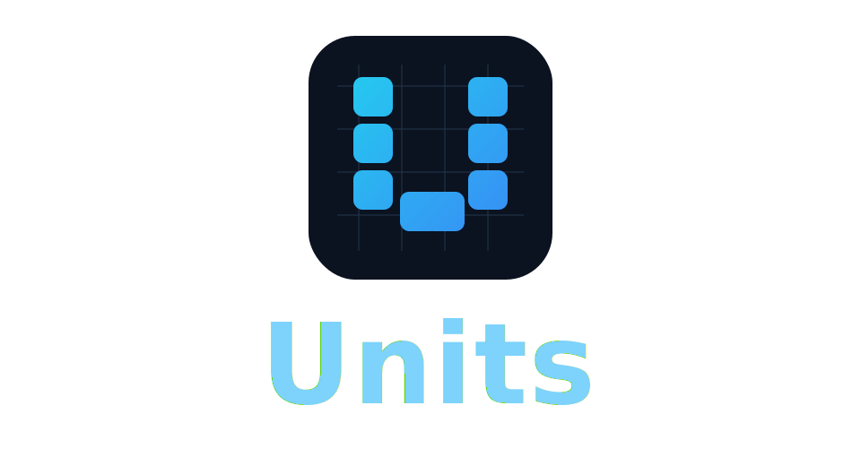

# Units

<p align="center">
  
</p>

<p align="center">
  <a href="https://botfather.github.io/units/"></a>
  <a href="./DOCS.md"></a>
  <a href="./DOCS-LLM.md"></a>
</p>

Units is a lightweight DSL for interactive UI. The monorepo covers the language runtime, Vite and CLI tooling, VS Code support, agent-facing UI compression, DOM and IR adapters, compilation, reference apps, and benchmark suites for both runtime and model workflows.

## Repo At A Glance

- `@botfather/units` is the core parser, printer, runtime, and custom renderer entry point.
- Vite, CLI, and editor tooling live in `@botfather/vite-plugin-units`, `@botfather/vite-plugin-units-tools`, `@botfather/units-tools`, and `vscode/units-vscode`.
- The agent pipeline spans compression, DOM capture, IR normalization, React adaptation, and DSL compilation.
- `examples/*`, `bench/*`, and `test/*` provide reference apps, benchmark corpora, and verification coverage.

## Package Matrix

| Package | Role | Notes |
| --- | --- | --- |
| `@botfather/units` | Core runtime | Parser, printer, React runtime, custom renderer, incremental parsing sketch |
| `@botfather/vite-plugin-units` | Build integration | Load `.ui` files in Vite |
| `@botfather/vite-plugin-units-tools` | Authoring helpers | Format, tokens, highlight, agent-targeted query imports |
| `@botfather/units-tools` | CLI tooling | Format, lint, snapshot, transform, verify, synthesize, library workflows |
| `@botfather/units-agent-middleware` | Agent middleware | Agent-agnostic UI tree rewrite layer |
| `@botfather/units-agent-plugin` | Agent API | `compressUiForAgent` DSL and AST output |
| `@botfather/units-agent-service` | HTTP wrapper | `/compress-ui` service for arbitrary agents |
| `@botfather/units-dom-snapshot` | DOM extraction | Neutral snapshot capture from pages and browser automation flows |
| `@botfather/units-ui-ir` | Neutral IR | `UiNode` schema and DOM or accessibility adapters |
| `@botfather/units-react-adapter` | React adapter | React or JSX element tree to `UiNode` IR |
| `@botfather/units-compiler` | Compiler | `UiNode` or IR to Units AST and DSL |
| `@botfather/units-uikit-shadcn` | UI kit | ShadCN-style component layer authored in Units |

## Examples

- `examples/learn-vite/` - reference site and learning-oriented demo
- `examples/todo-vite/` - todo workflow demo
- `examples/chat-vite/` - chat transcript demo
- `examples/shadcn-gallery-vite/` - ShadCN-style gallery demo
- `examples/portfolio-vite/` - portfolio header demo

## Key Repository Docs

- `README.md` - GitHub landing page and repo map
- `DOCS.md` - full technical documentation
- `DOCS-LLM.md` - LLM and agent-oriented authoring profile
- `vscode/units-vscode/` - VS Code extension for `.ui` files

## Website

- Home: https://botfather.github.io/units/
- Documentation hub: https://botfather.github.io/units/docs.html
- Examples: https://botfather.github.io/units/examples.html

## Quick Start

```js
import { parseUnits, renderUnits } from "@botfather/units";

const dsl = `
App {
  Header (title:'Dashboard')
  #if (@user.loggedIn) {
    List {
      #for (item, i in @items) {
        Card (key:@item.id) {
          text 'Item: '
          @item.name
          Button (label:'Select' !click { set(selected:=@item.id) })
        }
      }
    }
  }
  #slot (footer)
}
`;

const ast = parseUnits(dsl);
const element = renderUnits(ast, {
  user: { loggedIn: true },
  items: [{ id: 1, name: "One" }, { id: 2, name: "Two" }],
  set: (path, value) => console.log("set", path, value)
});
```

## Syntax (minimal)

```
Tag ( props ) { children }
Tag props { children }        // props inline
Tag { children }
Tag ( props )                 // self-closing if no children

text 'literal'
text 'Hello @{name}'         // inline interpolation inside text
'literal'                    // compact text shorthand
@expr                         // inline expression

#if (@cond) { ... }
#if @cond { ... }             // compact directive args
#for (item, i in @items) { ... }
#for item, i in @items { ... } // compact directive args
#slot (name) { ... }
#slot name                    // compact directive args
#key (@expr)
```

### Props
```
key:value        // literal value
key=@expr        // expression value
key?=@expr       // boolean prop if expr truthy
!click { ... }   // event handler shorthand
on:click={ ... } // event handler longhand
```

### Expressions
Expressions are raw JS strings evaluated at runtime. For performance, the parser never parses them.

The React runtime supports a lightweight `:=` assignment inside `set(...)` calls:
```
!click { set(selected:=@item.id) }
```
This is transformed into:
```
set('selected', @item.id)
```

Expression normalization only rewrites scope-style `@identifier` tokens outside quoted strings. Literal `@` characters inside string literals are preserved.

## React Runtime
`renderUnits(ast, scope, options)`

- `scope`: shared data model (can include `set`).
- `options.components`: map of custom components.
- `options.slots`: named slots (string/element or function).
- `options.set`: override for `set`.

## Custom Renderer
Use `createUnitsRenderer(host)` with host hooks:
```
const host = {
  element: (name, props, events, children) => ({ type: name, props, events, children }),
  text: (value) => ({ type: "text", value }),
  fragment: (children) => children,
};
```

The custom renderer follows the same directive flow semantics as the React runtime for `#if/#elif/#else` chains and `#for/#key`.

## Notes
- Parsing is O(n) and dependency-free.
- The grammar is intentionally small to keep parsing fast and extensible.
- AST nodes include `start`/`end` offsets for caching or incremental re-parse.

## Latest Benchmark (local)
Feb 5, 2026: 2000 parses in 15.197ms (~0.0075ms/parse) on Node v22.22.0.

See the [live benchmarks table](https://botfather.github.io/units/#benchmarks) for React vs DSL token comparisons.

## Benchmark
```
node ./bench.js
```

## Testing
Run the full repository test suite:
```
node --test
```

Run coverage:
```
node --test --experimental-test-coverage
```

## Run Entire Benchmark Suite
Set optional env vars first (same terminal session):
```
export OPENAI_API_KEY=...      # required for live/provider model-backed benchmarks
export IPERF3_HOST=...         # required for network suites in bench:system:run
export LLM_BENCH_MODELS=...    # optional override for bench:llm:live models (comma-separated)
```

Then run:
```
pnpm bench:parser
pnpm bench:dsl
pnpm bench:system:plan
pnpm bench:system:run
pnpm bench:llm
pnpm bench:llm:live
pnpm bench:react-vs-dsl
pnpm bench:react-vs-dsl:quick
pnpm bench:react-vs-dsl:provider
pnpm bench:react-vs-dsl:provider:both
pnpm bench:react-vs-dsl:provider:optimized
pnpm bench:ui-ps
pnpm bench:ui-ps:gate
```

## DSL Benchmark Suite
Run the DSL-specific benchmark suite:
```
pnpm bench:dsl
```

Quick smoke run:
```
pnpm bench:dsl:quick
```

What it measures:
- Parse throughput on curated `.ui` programs
- Format / printer throughput and format stability
- Custom-renderer throughput with realistic scope sizes
- Edit-loop cost via changed-range detection and `incrementalParse()`
- Corpus parse / format throughput over `bench/cases`, `examples`, and the ShadCN Units kit

Inputs:
- Suite config: `bench/dsl-bench.config.json`
- Curated cases: `bench/cases/*.ui`, `examples/*/src/*.ui`
- Corpus sweep: `bench/cases/`, `examples/`, `packages/units-uikit-shadcn/shadcn/`

Outputs:
- JSON metrics: `bench/results/dsl-bench.json`
- Markdown report: `bench/results/dsl-bench.md`

## LLM Benchmark (Token + Quality)
Offline reference run (estimated tokens):
```
pnpm bench:llm
```

Live model run (real usage tokens from API):
```
OPENAI_API_KEY=... pnpm bench:llm:live
```

Run live benchmark with custom model list (comma-separated), including newer models:
```
OPENAI_API_KEY=... LLM_BENCH_MODELS=gpt-4.1-mini,gpt-4o-mini,gpt-5-2025-08-07 pnpm bench:llm:live
```

Config lives in `bench/llm-cases.json`, with case files under `bench/cases/`.

## React vs DSL Benchmark (Token Usage)
Run an exhaustive paired benchmark to compare direct React code vs Units DSL:
```
pnpm bench:react-vs-dsl
```

Quick run:
```
pnpm bench:react-vs-dsl:quick
```

Inputs:
- Pair config: `bench/react-vs-dsl-pairs.json`
- Curated pairs: `bench/cases/*.jsx` vs `bench/cases/*.ui`
- Synthetic feature matrix: generated by `tools/react-vs-dsl-bench.mjs`

Outputs:
- JSON metrics: `bench/results/react-vs-dsl.json`
- Markdown report: `bench/results/react-vs-dsl.md`

Provider-tokenized run (exact `usage.input_tokens` from model API):
```
OPENAI_API_KEY=... pnpm bench:react-vs-dsl:provider
```

Provider + approx side-by-side on curated cases:
```
OPENAI_API_KEY=... pnpm bench:react-vs-dsl:provider:both
```

Provider + approx with compact optimized DSL pair set:
```
OPENAI_API_KEY=... pnpm bench:react-vs-dsl:provider:optimized
```

## UI-PS Baseline Benchmark
Run host-tree transform baseline scoring (completeness + efficiency) over curated fixtures and a verified seed library:
```
pnpm bench:ui-ps
```

Enforce CI-style thresholds against the latest benchmark output:
```
pnpm bench:ui-ps:gate
```

Outputs:
- JSON metrics + per-case candidate scoring: `bench/results/ui-ps-bench.json`
- Markdown report: `bench/results/ui-ps-bench.md`
- Gate thresholds: `bench/ui-ps-gates.json`
- Fixture corpus: `bench/ui-ps-fixtures.json` (expanded tricky patterns + explicit `semantic-loss` probes)

## UI-PS Tricky-Pattern Roadmap
Goal: keep compression wins honest by expanding tricky fixture coverage while preserving action/name/text semantics.

### Phase A: Near-term fixture expansion
- Add 10-20 new fixtures across:
  - Stacked modals and nested dialogs (`dialog` in `dialog`, focus-trap metadata).
  - Dense tables/data-grids (sortable headers, row actions, inline pagination).
  - Nested and multi-step forms (fieldset nesting, dependent inputs, required states).
  - Repeated cards/feeds (mixed-action cards, optional badges/tags, lazy placeholders).
  - Noisy text regions (alerts, banners, decorative separators, duplicated copy).
- Add explicit semantic-loss probes for each category where compression can drop distinct actions (for example: dual CTAs, adjacent toggles, split pagination controls).

### Phase B: Adapters and IR edge cases
- Add parity fixtures for DOM vs accessibility vs IR inputs representing the same workflow.
- Include edge cases:
  - Hidden-but-relevant state (`aria-expanded`, `checked`, `selected`, `disabled`).
  - Virtualized list snapshots (partial children + "load more" controls).
  - Mixed navigation semantics (`button` vs `link` with similar names).

### Phase C: Gate and scoring hardening
- Keep strict semantic gates:
  - `action_recall = 1.0`
  - `name_recall >= 0.98`
  - `text_f1 >= 0.95`
- Add per-tag visibility in reports so regressions are easy to locate (`modal`, `table`, `semantic-loss`, etc.).
- Raise `bench/ui-ps-gates.json` thresholds as corpus grows (case count, semantic-loss pass count, transformed count) and enforce through CI.

### Definition of done for each expansion batch
- Every new tricky category includes at least:
  - 2 normal fixtures
  - 1 semantic-loss probe
- `pnpm bench:ui-ps` and `pnpm bench:ui-ps:gate` pass locally and in CI.
- The markdown benchmark report shows no semantic-loss gate failures for the new tags.

## System Benchmarking
Install the standard benchmark CLI tools:
```
make bench-system-install
```

Alias:
```
make install-bench-tools
```

Generate a machine-aware benchmark plan without executing the benchmarks:
```
make bench-system-plan
```

Run the system benchmark test coverage:
```
make test-system-bench
```

## Demo
Start with the example that matches the layer you want to inspect:

- `examples/learn-vite` for the reference site and learning-oriented walkthrough
- `examples/todo-vite` for a complete Vite todo app in `.ui`
- `examples/chat-vite` for nested chat-style UI
- `examples/shadcn-gallery-vite` for the ShadCN-inspired component layer
- `examples/portfolio-vite` for a smaller branding and layout composition example

For the GitHub Pages version of that entry point, see https://botfather.github.io/units/.

For full docs, see `DOCS.md`.

## ShadCN Units UI Kit
The repo includes a ShadCN-style component library authored in Units DSL in `packages/units-uikit-shadcn/`.

Quick wiring (React runtime):
```js
import { renderUnits } from "@botfather/units/runtime";
import { withShadcnComponents } from "@botfather/units-uikit-shadcn";
import uiAst from "./app.ui";

const options = withShadcnComponents();
renderUnits(uiAst, { /* scope */ }, options);
```

You can also generate a manifest for the `.ui` templates:
```
units-manifest packages/units-uikit-shadcn/shadcn packages/units-uikit-shadcn/shadcn-manifest.js
```

## Vite Plugin
Use `@botfather/vite-plugin-units` to load `.ui` files as AST at build time.

Example:
```js
import units from "@botfather/vite-plugin-units";
export default { plugins: [units()] };
```

TypeScript:
- `@botfather/vite-plugin-units` ships its own plugin types.
- For `.ui` imports, add `/// <reference types="@botfather/units/ui" />` in a global `d.ts` file.

## Syntax Highlighting / Pretty Print
Use `@botfather/vite-plugin-units-tools` to load:
- `.ui?format` for pretty-printed source
- `.ui?tokens` for tokenized output suitable for syntax highlighting
- `.ui?highlight` for prebuilt HTML spans
- `.ui?agent` for agent-targeted DSL payload + rough token estimates

TypeScript Support:
- `@botfather/vite-plugin-units-tools` ships its own plugin types.

## CLI Tools
The `@botfather/units-tools` package provides CLI utilities for managing Units files:
- `units-format <file-or-dir>`: Format all `.ui` files in a directory.
- `units-lint <file-or-dir>`: Lint for syntax and formatting consistency.
- `lint-ui [targets...]`: Lint all `.ui` files in `examples/` and `packages/units-uikit-shadcn/` (or pass targets).
- `units-watch <rootDir> <outFile>`: Watch and emit AST changes.
- `units-snapshot --url <https://example.com>`: Capture neutral UI tree snapshots from arbitrary web pages.
- `units-transform --program <program.ui> --input <tree.json>`: Run transform DSL against host trees.
- `units-verify ...`: Score transform output and apply reward gates.
- `units-synthesize ...`: Run iterative candidate refinement with deterministic verification.
- `units-library inspect|promote|rollback ...`: Manage verified transform program library.

## VS Code Extension
See `vscode/units-vscode` for the Units VS Code extension, which adds syntax highlighting, snippets, formatting-on-save support, and an icon theme for `.ui` files.

## Contributing
See `CONTRIBUTING.md` for development workflow and guidelines.

## Security
See `SECURITY.md` for reporting vulnerabilities.

## License
MIT. See `LICENSE`.
